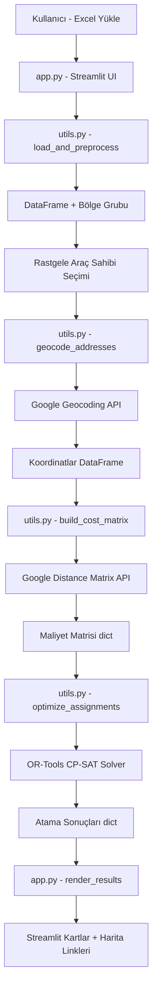

# Design Document

## Overview

Araç-Yolcu Optimizasyon Uygulaması, Streamlit tabanlı bir web arayüzüdür. Kullanıcı bir Excel dosyası yükler, araç sahibi sayısını belirler, sistem Google Maps API ile koordinat ve mesafe hesabı yapar, OR-Tools ile global optimal atama gerçekleştirir ve sonuçları harita linkleriyle birlikte görsel kartlar halinde sunar.

Veri gerçeği: 259 kişi, sütunlar: İsim Soyisim, Adres, İlçe, Posta Kodu. 10 araç sahibi seçildiğinde maksimum 30 yolcu atanabilir; kalan 219 kişi "atanamamış" listesinde görünür.

## Architecture



## Components and Interfaces

### `utils.py` — 5 ana fonksiyon

```python
def load_and_preprocess(file_path: str) -> pd.DataFrame:
    """
    Excel okur, sütun adlarını normalize eder,
    Bölge Grubu sütunu ekler (Posta Kodu[:4]).
    Returns: DataFrame
    Raises: ValueError (eksik sütun), FileNotFoundError
    """

def select_drivers(df: pd.DataFrame, n: int, seed: int = None) -> pd.DataFrame:
    """
    DataFrame'e 'Rol' sütunu ekler: n kişi 'Araç Sahibi', geri kalan 'Yolcu'.
    Rastgele seçim; seed parametresi test tekrarlanabilirliği için.
    Returns: DataFrame (Rol sütunu eklenmiş)
    """

def geocode_addresses(df: pd.DataFrame, api_key: str) -> pd.DataFrame:
    """
    Her satır için Google Geocoding API çağrısı yapar.
    Sonuçları 'Lat' ve 'Lng' sütunlarına yazar.
    Önbellekleme: st.session_state['geocode_cache'] dict kullanır.
    Returns: DataFrame (Lat, Lng sütunları eklenmiş)
    """

def build_cost_matrix(df: pd.DataFrame, api_key: str) -> dict:
    """
    Bölge Grubu bazında gruplar.
    Her grup için araç sahipleri (origins) ve yolcular (destinations) arasında
    Distance Matrix API çağrısı yapar (max 10x10 batch).
    Returns: {(driver_idx, passenger_idx): distance_meters}
    """

def optimize_assignments(df: pd.DataFrame, cost_matrix: dict, max_capacity: int = 3) -> dict:
    """
    OR-Tools CP-SAT Solver ile global optimal atama.
    Kısıt: her araç sahibine max_capacity yolcu.
    Hedef: toplam mesafeyi minimize et.
    Returns: {driver_idx: [passenger_idx, ...]}
    """
```

### `app.py` — Streamlit UI akışı

```
1. Sidebar: API key durumu, uygulama hakkında
2. Adım 1 — Dosya Yükleme: st.file_uploader → özet metrikler
3. Adım 2 — Araç Sahibi Seçimi: st.number_input + buton → tablo gösterimi
4. Adım 3 — Geocoding: "Koordinatları Hesapla" butonu → progress bar
5. Adım 4 — Optimizasyon: "Optimizasyonu Çalıştır" butonu → spinner
6. Adım 5 — Sonuçlar: Araç sahibi kartları + atanamamış yolcular
```

### `generate_sample_excel.py` — Yardımcı script

Mevcut Excel'i okur, sütun adlarını standartlaştırır, çıktı olarak `sample_data.xlsx` üretir. Test ve demo için kullanılır.

## Data Models

### Ana DataFrame şeması

| Sütun | Tip | Açıklama |
|---|---|---|
| İsim Soyisim | str | Kişinin tam adı |
| Adres | str | Sokak adresi |
| İlçe | str | İlçe adı |
| Posta Kodu | int/str | 5 haneli posta kodu |
| Bölge Grubu | str | Posta kodunun ilk 4 hanesi |
| Rol | str | "Araç Sahibi" veya "Yolcu" (select_drivers sonrası) |
| Lat | float | Enlem (geocoding sonrası) |
| Lng | float | Boylam (geocoding sonrası) |

### Maliyet Matrisi

```python
cost_matrix: dict[tuple[int, int], int]
# Örnek: {(0, 5): 2300, (0, 12): 4100, ...}
# Key: (driver_df_index, passenger_df_index)
# Value: metre cinsinden sürüş mesafesi
```

### Atama Sonuçları

```python
assignments: dict[int, list[int]]
# Örnek: {0: [5, 12, 23], 3: [7, 19], ...}
# Key: araç sahibinin DataFrame index'i
# Value: atanan yolcuların DataFrame index listesi
```

## OR-Tools Optimizasyon Detayı

CP-SAT Solver kullanılır. Değişkenler, kısıtlar ve hedef:

```python
# x[i][j] = 1 ise driver i, passenger j'yi taşır
x = {}
for i in drivers:
    for j in passengers:
        if (i, j) in cost_matrix:
            x[i, j] = model.NewBoolVar(f'x_{i}_{j}')

# Kısıt 1: Her yolcu en fazla 1 araç sahibine atanır
for j in passengers:
    model.Add(sum(x[i,j] for i in drivers if (i,j) in cost_matrix) <= 1)

# Kısıt 2: Her araç sahibine en fazla max_capacity yolcu
for i in drivers:
    model.Add(sum(x[i,j] for j in passengers if (i,j) in cost_matrix) <= max_capacity)

# Hedef: toplam mesafeyi minimize et
model.Minimize(sum(cost_matrix[i,j] * x[i,j] for (i,j) in x))
```

Bölge grubu kısıtı: farklı bölgedeki araç sahibi-yolcu çiftleri için cost_matrix'te entry bulunmaz, dolayısıyla o çiftler otomatik olarak atama dışı kalır.

## API Kullanım Optimizasyonu

### Geocoding
- Her adres için 1 API çağrısı
- `st.session_state['geocode_cache']` ile oturum içi önbellekleme
- 259 kişi = max 259 Geocoding API çağrısı (ilk çalıştırmada)

### Distance Matrix
- Bölge grubu bazında gruplandırma: sadece aynı bölgedeki çiftler hesaplanır
- Batch boyutu: max 10 origin × 10 destination = 100 element/çağrı
- En büyük bölge (3484, 22 kişi): 10 araç sahibi × 22 yolcu = ~3 batch çağrısı
- Toplam tahmini Distance Matrix çağrısı: ~20-30 (tüm bölgeler için)

## Error Handling

| Senaryo | Davranış |
|---|---|
| Geçersiz Excel formatı | ValueError yakalanır, st.error ile gösterilir |
| Eksik sütun | Eksik sütun adları listelenerek kullanıcıya bildirilir |
| Geocoding başarısız | Kişi atama dışı bırakılır, sayaç tutulur |
| API key eksik/geçersiz | .env kontrolü yapılır, st.error ile yönlendirme gösterilir |
| OR-Tools çözüm bulunamaz | INFEASIBLE durumu yakalanır, kullanıcıya bildirilir |
| Bölgede araç sahibi yok | Yolcular "atanamamış" listesine eklenir |

## Testing Strategy

- `generate_sample_excel.py` ile deterministik test verisi üretimi (seed=42)
- `utils.py` fonksiyonları için `pytest` unit testleri: `test_utils.py`
  - `test_load_and_preprocess`: sütun kontrolü, Bölge Grubu oluşturma
  - `test_select_drivers`: sayı doğruluğu, Rol sütunu varlığı
  - `test_optimize_assignments`: kapasite kısıtı, toplam atama sayısı
- API çağrıları `unittest.mock` ile mock'lanır; gerçek API testleri ayrı tutulur
- Streamlit UI testi: manuel smoke test (otomatik UI testi kapsam dışı)
